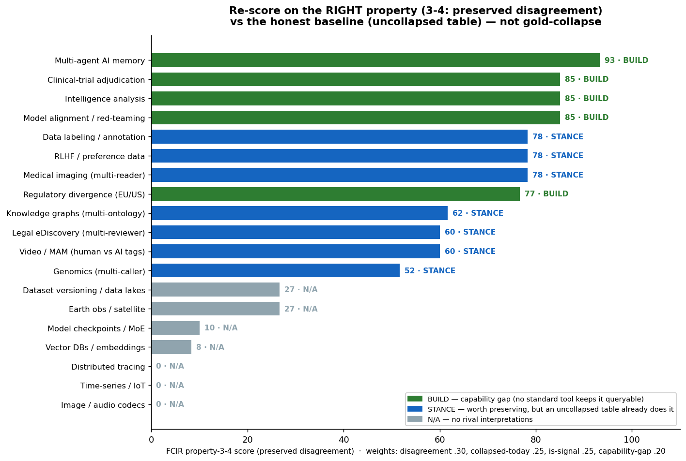

# Re-score on FCIR property 3-4 (preserved disagreement) — the right lens

> The original [scorecard](APPLICABILITY_SCORECARD.md) weighted properties 1-2 (substrate + selective read), already SOTA → mostly ANCHOR. The meta-critique was right that this is the wrong lens. Here we re-score on **property 3-4** with the **honest baseline** (an uncollapsed `(item, source, value)` table, not a gold-collapsed store — see `../directions/RESULTS_DISAGREEMENT_COMPUTE.md`).



| # | domain | score | verdict | why |
|---|---|---|---|---|
| 1 | Multi-agent AI memory | **93** | BUILD | agents forced to consensus; no standard queryable disagreement layer |
| 2 | Clinical-trial adjudication | **85** | BUILD | committees converge to one endpoint; disagreement pattern manual/post-hoc |
| 3 | Intelligence analysis | **85** | BUILD | source-reliability disagreement is the signal; systems converge to one assessment |
| 4 | Model alignment / red-teaming | **85** | BUILD | red/blue disagreement is diagnostic; logged but not a queryable layer |
| 5 | Data labeling / annotation | **78** | STANCE | disagreement real & signal, BUT CrowdTruth / uncollapsed tables already keep it |
| 6 | RLHF / preference data | **78** | STANCE | increasingly kept per-annotator; uncollapsed tables do the queries |
| 7 | Medical imaging (multi-reader) | **78** | STANCE | DICOM SEG keeps multiple; adjudication often collapses downstream |
| 8 | Regulatory divergence (EU/US) | **77** | BUILD | firms keep SEPARATE systems per jurisdiction (duplication, not co-registration) |
| 9 | Knowledge graphs (multi-ontology) | **62** | STANCE | named graphs + SPARQL already keep & query rival triples |
| 10 | Legal eDiscovery (multi-reviewer) | **60** | STANCE | reviewer disagreement tracked as QC; tables already do it |
| 11 | Video / MAM (human vs AI tags) | **60** | STANCE | conflicting tags logged with provenance; queryable already |
| 12 | Genomics (multi-caller) | **52** | STANCE | bcftools isec already compares rival VCFs |
| 13 | Dataset versioning / data lakes | **27** | N/A | versions, not contradictory interpretations of the same element |
| 14 | Earth obs / satellite | **27** | N/A | co-registered products, rarely contradictory rival readings |
| 15 | Model checkpoints / MoE | **10** | N/A | adapters are alternatives, not contradictions; no adjudication |
| 16 | Vector DBs / embeddings | **8** | N/A | model variants exist but not contradictory readings of one element |
| 17 | Distributed tracing | **0** | N/A | no rival interpretations of a span |
| 18 | Time-series / IoT | **0** | N/A | single signal value; no contradiction |
| 19 | Image / audio codecs | **0** | N/A | one perceptual ground truth |

## What the re-score shows (honest)

1. **The map does invert — the critique was right about that.** The 1-2 ANCHOR domains (codecs, traces, checkpoints, lakeFS, satellite) **drop to N/A** here: they have no rival interpretations. The disagreement-rich domains rise.
2. **But almost all the risers are `STANCE`, not `BUILD`.** Disagreement matters and is often collapsed today — yet the *capability* to keep it queryable already exists in an uncollapsed table (CrowdTruth, named graphs, per-annotator datasets). FCIR's value there is the **discipline** (don't collapse on write) + **co-registration**, not a new capability. This matches the disagreement-compute test: gold-collapse 0/4, uncollapsed table 4/4.
3. **The genuine `BUILD` candidates are where no standard tool keeps it queryable:** **multi-agent AI memory** (the clearest — agents forced to consensus, no queryable disagreement layer), and arguably **clinical-trial adjudication, intel analysis, red-teaming, regulatory divergence** (workflows manual/siloed). These are *untested hypotheses* — the same status as any direction until measured.

**Net:** re-scoring on the right property corrects the bias the critique exposed, **and** confirms the honest conclusion: the value is preserving disagreement as a discipline/model (FCIR), not a capability that does not exist elsewhere. The one place worth building is **multi-agent memory** — exercised next in `bhmemx/`.

## Sharpening STANCE vs BUILD (second critique)

A reviewer noted the original split was too lax: "the capability exists in an
uncollapsed table" was being read as STANCE even where **no one keeps that table**
because the workflow destroys it. That conflates *technical possibility* with
*operational reality*. The sharper definition we now use:

```
STANCE: the capability exists AND is kept queryable in production by someone
        (an uncollapsed table is actually maintained as a live object).
BUILD:  the capability exists in principle but is SYSTEMATICALLY DESTROYED by the
        workflow, tool, or regulation — no one keeps it as a first-class object.
```

Under this lens, **clinical-trial adjudication, intel analysis, regulatory
divergence** move firmly to `BUILD` — not because the table is impossible, but
because the regulatory/operational process *requires* a single adjudicated value
and discards the rival readings by design. The gap FCIR fills there is real even
though the capability is, in the abstract, "just a `GROUP BY`." (Honest caveat in
the other direction — the [optionality-illusion limit](../BH_PRINCIPLE.md#honest-scope):
if every downstream consumer demands a scalar, preserving the matrix buys
provenance, not genuine deferral.)
